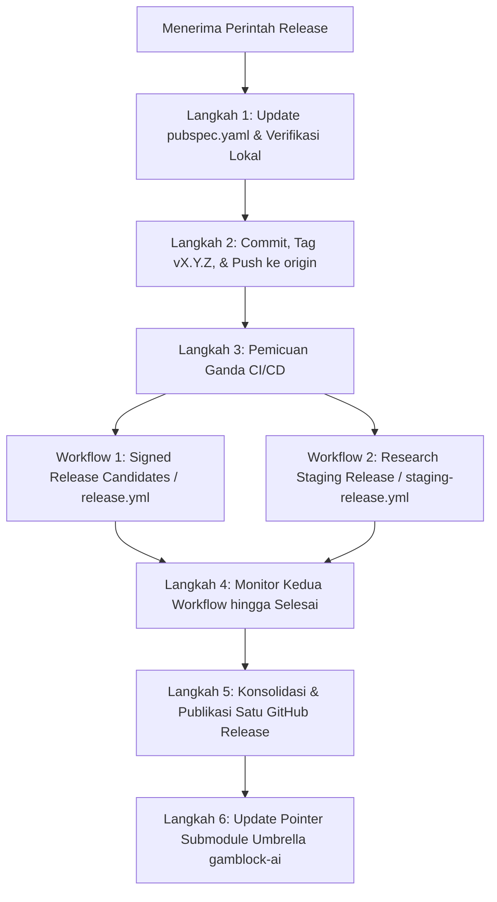

# Gamblock-AI Apps: AI Release Workflow SOP

Dokumen ini adalah **Standard Operating Procedure (SOP)** wajib bagi AI assistant / developer saat menerima instruksi untuk membuat rilis baru (contoh: *"buat release baru 1.4.0"*, *"create release v1.5.0"*).

---

## 1. Aturan Baku & Invarian Rilis (Non-Negotiable)

1. **Prinsip 1 Versi = 1 Halaman Rilis (Single Unified Grouping)**:
   - Seluruh varian build untuk nomor versi yang sama **WAJIB** berada dalam **SATU** halaman rilis GitHub yang sama pada URL:
     `https://github.com/Gamblock-AI/Gamblock-AI-Apps/releases/tag/v<VERSION>`
   - **DILARANG KERAS** membuat halaman release terpisah (misalnya membuat release terpisah `research-staging-v<VERSION>`).
   - Jangan pernah berhenti hanya pada langkah `git tag` atau `git push`. Rilis dinyatakan selesai HANYA jika file biner instalasi telah sukses diunggah ke GitHub Releases.

2. **Daftar Asset Wajib dalam Setiap Rilis**:
   Setiap rilis versi `v<VERSION>` wajib memuat minimal 5 file biner utama + manifest checksum:
   - **Production Stream** (Terkoneksi ke backend `https://api.gamblock-ai.com`):
     1. `gamblock-ai-play-<VERSION>+<BUILD>.aab` (Google Play Store Bundle)
     2. `gamblock-ai-research-<VERSION>+<BUILD>.apk` (Android Research APK Production)
     3. `GamblockAI-Pilot-<VERSION>-x64.msi` (Windows Installer Pilot Production)
   - **Staging Stream** (Terkoneksi ke backend `https://api-staging.gamblock-ai.com` untuk QA/testing):
     4. `gamblock-ai-research-staging-<VERSION>+<BUILD>.apk` (Android Research APK Staging)
     5. `GamblockAI-Pilot-Staging-<VERSION>-x64.msi` (Windows Installer Pilot Staging)
   - **Manifest & Checksums**:
     6. `android-SHA256SUMS.txt`
     7. `windows-SHA256SUMS.txt`
     8. `android-research-permissions.txt`

---

## 2. Prosedur Eksekusi Langkah-demi-Langkah (End-to-End Playbook)



### Langkah 1: Persiapan Versi & Verifikasi Kualitas Lokal
1. Buka `gamblock_ai_apps/pubspec.yaml`, perbarui baris versi:
   ```yaml
   version: <VERSION>+1
   ```
2. Jalankan pemeriksaan linter dan unit test lokal:
   ```bash
   cd gamblock_ai_apps
   ./scripts/verify.sh
   flutter test
   ```
   *Pastikan tidak ada issue linter (`No issues found!`) dan seluruh test lulus 100%.*

### Langkah 2: Commit, Tagging, & Push
1. Lakukan commit dan tagging rilis:
   ```bash
   git add pubspec.yaml
   git commit -m "chore(release): bump version to <VERSION>+1"
   git tag -a v<VERSION> -m "Release v<VERSION>"
   git push origin main
   git push origin v<VERSION>
   ```

### Langkah 3: Pemicuan Ganda CI/CD (Production + Staging)
1. Push tag `v<VERSION>` otomatis memicu workflow **Production** (`release.yml` - *Signed Release Candidates*).
2. **Segera picu** workflow **Staging** (`staging-release.yml` - *Research Staging Release*) secara manual menggunakan GitHub CLI:
   ```bash
   gh workflow run staging-release.yml -f version=<VERSION>
   ```

### Langkah 4: Pemantauan Build CI/CD
1. Pantau status kedua workflow menggunakan GitHub CLI:
   ```bash
   gh run list --limit 5
   ```
2. Pastikan kedua workflow selesai dengan status sukses (`✓` / conclusion `success`).
   - `release.yml` memvalidasi dan mengunggah asset production ke `v<VERSION>`.
   - `staging-release.yml` memvalidasi dan mengunggah asset staging ke release `v<VERSION>` yang sama.
   - Kedua publish job menggunakan concurrency key yang sama agar upload tidak saling menimpa.
   - Jika terjadi kegagalan (misalnya error kompilasi/test), perbaiki pada commit baru, buat tag semver baru, dan jalankan ulang kedua workflow. Jangan memindahkan tag immutable yang sudah dipublikasikan.

### Langkah 5: Verifikasi Satu GitHub Release Tunggal
1. Setelah kedua workflow sukses, verifikasi seluruh asset pada tag yang sama:
   ```bash
   gh release view v<VERSION> --json tagName,assets,isDraft,isPrerelease
   ```
2. Pastikan release `v<VERSION>` memuat lima binary utama dan tiga manifest:
   - production Play AAB, Research APK, dan Windows MSI;
   - staging Research APK dan Windows MSI;
   - `android-SHA256SUMS.txt`, `windows-SHA256SUMS.txt`, dan
     `android-research-permissions.txt`.
3. Tidak ada workflow yang membuat `research-staging-v<VERSION>` atau asset
   `latest` terpisah.

### Langkah 6: Sinkronisasi Umbrella Repository
1. Masuk ke root direktori umbrella repository `gamblock-ai`:
   ```bash
   cd /home/alfiang/Projects/gamblock-ai
   git add gamblock_ai_apps
   git commit -m "chore: bump gamblock_ai_apps submodule to v<VERSION>"
   git push origin main
   ```

---

## 3. Format Catatan Rilis Standar (Release Notes Template)

```markdown
## Gamblock-AI Apps v<VERSION>

Complete release candidate bundle containing both **Production** and **Staging** builds for Android and Windows.

---

### What's New & Changed in v<VERSION>
- **Android AI & Browser Sensing**:
  - <Highlight fitur / perbaikan AI & sensing>
- **UI & Intervention**:
  - <Highlight perubahan UI / intervensi>
- **Tour & UX Experience**:
  - <Highlight perbaikan navigasi & tour>

---

### Downloads & Build Variants

#### 1. Production Builds (Connected to `api.gamblock-ai.com`)
- **Play Store Bundle**: `gamblock-ai-play-<VERSION>+<BUILD>.aab` (Google Play Store candidate)
- **Android Research APK**: `gamblock-ai-research-<VERSION>+<BUILD>.apk` (Signed Research APK)
- **Windows Installer**: `GamblockAI-Pilot-<VERSION>-x64.msi` (Signed Windows x64 Pilot Installer)

#### 2. Staging Builds (Connected to `api-staging.gamblock-ai.com` for QA/Testing)
- **Android Staging APK**: `gamblock-ai-research-staging-<VERSION>+<BUILD>.apk` (Research APK Staging)
- **Windows Staging Installer**: `GamblockAI-Pilot-Staging-<VERSION>-x64.msi` (Windows Installer Staging)

#### 3. Verification & Checksums
- `android-SHA256SUMS.txt`
- `windows-SHA256SUMS.txt`
- `android-research-permissions.txt`
```

---

## 4. Checklist Ringkas untuk Agen AI

Saat pengguna meminta rilis baru:
- [ ] Versi `pubspec.yaml` sudah dinaikkan (`<version>+1`).
- [ ] `./scripts/verify.sh` dan `flutter test` lulus 100%.
- [ ] Tag `v<version>` sudah di-push.
- [ ] `staging-release.yml` sudah dipicu via `gh workflow run`.
- [ ] Kedua workflow GitHub Actions (`release.yml` dan `staging-release.yml`) selesai sukses.
- [ ] Seluruh 5 file biner (Play AAB, Prod APK, Prod MSI, Staging APK, Staging MSI) terlampir di SATU release `v<version>`.
- [ ] Tidak ada release terpisah seperti `research-staging-v<version>`.
- [ ] Pointer submodule umbrella `gamblock-ai` telah disinkronkan ke commit rilis.
